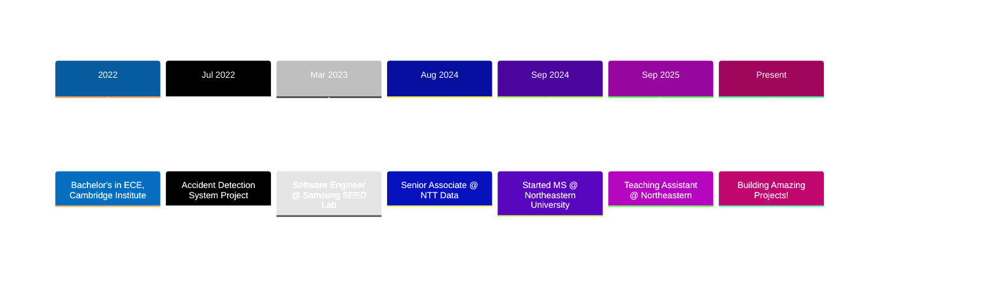

<div align="center">
  
# 👋 Hi, I'm Nithish Kumar K M

### Full-Stack Developer | Cloud Engineer | UI/UX Enthusiast


[](https://linkedin.com/in/nithish-kumar-km)
[](mailto:kuthandhallimanjun.n@northeastern.edu)
[](https://github.com/nithish-kumar-km)
[](https://github.com/nithish-kumar-km)

</div>

---

## 🚀 About Me

```javascript
const nithish = {
    location: "Boston, MA 📍",
    education: "MS in Information Systems @ Northeastern University",
    currentRole: "Teaching Assistant - Web Design & UX",
    previousRoles: ["Senior Associate @ NTT Data", "Software Engineer @ Samsung SEED Lab"],
    graduating: "December 2026",
    passion: "Building scalable, user-centric applications",
    currentlyLearning: ["Advanced Cloud Architecture", "System Design", "Microservices"],
    funFact: "I've annotated 10,000+ images for AI training! 🤖"
};
```

---

## 💼 Professional Experience



---

## 🛠️ Tech Stack

<div align="center">

### 💻 Languages


### 🎨 Frontend Development


### ⚙️ Backend Development


### 🗄️ Databases


### ☁️ Cloud & DevOps


### 🎯 Design & Tools


</div>

---

## 📊 GitHub Stats

<div align="center">
  


</div>

<div align="center">
  
[](https://git.io/streak-stats)

</div>

---

## 🎯 Featured Projects

<div align="center">

<table>
<tr>
<td width="50%">

### 🍔 EatWell Food Ordering Platform


Full-stack MERN application with Stripe payments, cart management, and order tracking.

**Impact:** 35% UX improvement, 40% faster performance

[View Project →](https://github.com/YOUR_USERNAME/eatwell)

</td>
<td width="50%">

### 🛍️ Myntra Web Application


E-commerce platform with 10+ features including authentication, reviews, and admin panel.

**Impact:** 30% increase in user engagement

[View Project →](https://github.com/YOUR_USERNAME/myntra)

</td>
</tr>

<tr>
<td width="50%">

### 💼 Personal Portfolio


Interactive portfolio with theme toggle, smooth animations, and responsive design.

[Live Demo →](https://your-portfolio-url.com)

</td>
<td width="50%">

### 🚗 Accident Detection System


IoT system using sensors, GSM/GPS for real-time accident detection and alerts.

[View Project →](https://github.com/YOUR_USERNAME/accident-detection)

</td>
</tr>
</table>

</div>

---

## 🏆 Achievements & Highlights

<div align="center">

| 📚 Teaching | 💼 Professional | 🎓 Academic |
|:---:|:---:|:---:|
| **TA @ Northeastern** | **15% Performance Boost** | **GPA: 3.8/4.0** |
| Web Design & UX | at NTT Data | MS in Information Systems |
| **50+ Students Mentored** | **20% Dev Time Reduction** | **Expected Dec 2026** |
| Hands-on Labs & Grading | Clean, Scalable Code | Northeastern University |

</div>

---

## 📈 Contribution Graph

<div align="center">

[](https://github.com/YOUR_USERNAME)

</div>

---

## 🎓 Education

```
🎓 Northeastern University, Boston, MA
   Master of Science in Information Systems
   GPA: 3.8/4.0 | Expected: December 2026
   
🎓 Cambridge Institute of Technology, Bangalore, India
   Bachelor of Engineering in Electronics & Communication
   GPA: 3.07/4.0 | Graduated: September 2022
```

---

## 💡 What I'm Working On

- 🔭 Building serverless applications with AWS Lambda and API Gateway
- 🌱 Learning advanced system design and microservices architecture
- 👨‍🏫 Teaching web development to 50+ students at Northeastern
- 🚀 Contributing to open-source projects
- 📝 Writing technical blogs about cloud computing and full-stack development

---

## 📫 Let's Connect!

<div align="center">

I'm always open to interesting conversations and collaboration opportunities!

[](https://linkedin.com/in/nithish-kumar-km)
[](mailto:kuthandhallimanjun.n@northeastern.edu)
[](https://your-portfolio-url.com)

**📍 Boston, MA | 📞 617-721-0107**

</div>

---

<div align="center">

### 💭 Quote of the Day


---

### 👀 Profile Views


---

⭐️ From [Nithish Kumar K M](https://github.com/YOUR_USERNAME)

**"Code is like humor. When you have to explain it, it's bad." – Cory House**

</div>
