```mermaid
%%{init: {'theme':'base', 'themeVariables': { 'primaryColor':'#FF6B6B','secondaryColor':'#4ECDC4','tertiaryColor':'#FFE66D','primaryBorderColor':'#FF6B6B','lineColor':'#95E1D3','fontSize':'16px'}}}%%
graph LR
    START[🏁 START LINE<br/>2018] -->|🏎️| A[🔌 Electronics<br/>Engineering<br/>IoT & Embedded]
    A -->|💨 Speed Boost!| B[🤖 AI/ML Engineer<br/>Samsung SEED<br/>10K+ Images]
    B -->|🔥 Turbo Mode!| C[💻 Full-Stack Dev<br/>NTT Data<br/>.NET + React]
    C -->|⚡ Nitro Boost!| D[☁️ Cloud Architect<br/>AWS Master<br/>Serverless Pro]
    D -->|🚀 Maximum Speed!| E[🎯 Software Engineer<br/>Building at Scale<br/>2024+]
    E --> FINISH[🏆 FINISH LINE<br/>Success!]
    
    style START fill:#32CD32,stroke:#32CD32,stroke-width:4px,color:#fff
    style A fill:#FF6B6B,stroke:#FF6B6B,stroke-width:3px,color:#fff
    style B fill:#4ECDC4,stroke:#4ECDC4,stroke-width:3px,color:#fff
    style C fill:#FFE66D,stroke:#FFE66D,stroke-width:3px,color:#000
    style D fill:#FF69B4,stroke:#FF69B4,stroke-width:3px,color:#fff
    style E fill:#9370DB,stroke:#9370DB,stroke-width:3px,color:#fff
    style FINISH fill:#FFD700,stroke:#FFD700,stroke-width:4px,color:#000
```

<div align="center">

<!-- Animated Header -->


<!-- Typing Animation -->
<a href="https://git.io/typing-svg">
  
</a>

<!-- Social Badges -->
<p align="center">
  <a href="https://linkedin.com/in/nithish-kumar-km">
    
  </a>
  <a href="mailto:kuthandhallimanjun.n@northeastern.edu">
    
  </a>
  <a href="https://github.com/NithishKumar2424">
    
  </a>
  <a href="tel:+16177210107">
    
  </a>
</p>

</div>

---

## 🎯 **About Me - The Code Version**

```typescript
interface Developer {
    name: string;
    location: string;
    role: string[];
    code: string[];
    architecture: string[];
    currentMission: string;
}

const nithish: Developer = {
    name: "Nithish Kumar K M",
    location: "Boston, MA 🇺🇸",
    role: [
        "💼 Former Senior Associate @ NTT Data",
        "🔬 Former Software Engineer @ Samsung SEED Lab",
        "🎓 MS Student @ Northeastern University"
    ],
    code: ["JavaScript", "Python", "Java", "C#", "C++", "SQL"],
    architecture: ["AWS", "Docker", "Kubernetes", "Microservices", "REST APIs"],
    currentMission: "Building scalable, secure cloud applications and mastering full-stack development"
};

// My Journey
const educationJourney = {
    current: "🎓 MS in Information Systems @ Northeastern | GPA: 3.8/4.0",
    graduation: "December 2026",
    previous: "🎓 BE in Electronics & Communication @ CIT, Bangalore | GPA: 3.07/4.0"
};

// Fun Stats
const stats = {
    imagesAnnotated: "10,000+ for AI/ML models 🤖",
    performanceBoost: "15% system optimization @ NTT 🚀",
    codeQuality: "20% faster development cycles ⚡",
    funFact: "I debug code faster than I debug my life 😄"
};

console.log("Thanks for visiting! Let's build something amazing together 🚀");
```

---

<div align="center">

## 🏎️ **PLAY MY CAREER RACE GAME!** 🏁

### 🎮 Experience my journey interactively - Race through my career milestones!

<a href="YOUR_GAME_URL_HERE">
  
</a>

**Controls:** Use ← → Arrow Keys to steer | ↑ to speed up | Race through 500km to complete my journey!

### 🏆 **Race Milestones:**

<p align="center">
🏁 <b>START (2018)</b><br/>
↓ 50km  → 🎓 Electronics Engineering - IoT & Embedded Systems<br/>
↓ 150km → 🤖 AI/ML Engineer @ Samsung - 10K+ Images Trained<br/>
↓ 250km → 💻 Full-Stack Developer @ NTT Data - React + .NET<br/>
↓ 350km → ☁️ Cloud Architect - AWS + DevOps Master<br/>
↓ 450km → 🎯 Software Engineer - Building at Scale<br/>
🏆 <b>FINISH - Journey Complete!</b>
</p>

<details>
<summary><b>📸 Game Preview (Click to see)</b></summary>
<br/>



</details>

</div>

---

<div align="center">

### 🏎️ **Race Track Progress - Career Speedometer**

<table>
<tr>
<td align="center" width="20%">
<h3>🏁</h3>
<b>LAP 1</b><br/>
<sub>🔌 Electronics Engineer</sub><br/>
<sub>⚡ IoT & Embedded Systems</sub><br/>
<br/>
<code>▰▰▰▰▱</code><br/>
<sub>2018-2022 ✓</sub>
</td>
<td align="center" width="20%">
<h3>🏎️</h3>
<b>LAP 2</b><br/>
<sub>🤖 AI/ML Specialist</sub><br/>
<sub>🐍 Python + Data Science</sub><br/>
<br/>
<code>▰▰▰▰▱</code><br/>
<sub>2022-2023 ✓</sub>
</td>
<td align="center" width="20%">
<h3>🏎️💨</h3>
<b>LAP 3</b><br/>
<sub>💻 Full-Stack Developer</sub><br/>
<sub>⚛️ React + .NET</sub><br/>
<br/>
<code>▰▰▰▰▱</code><br/>
<sub>2023-2024 ✓</sub>
</td>
<td align="center" width="20%">
<h3>🏎️🔥</h3>
<b>LAP 4</b><br/>
<sub>☁️ Cloud Architect</sub><br/>
<sub>🚀 AWS + DevOps</sub><br/>
<br/>
<code>▰▰▰▰▰</code><br/>
<sub>2024+ 🔄</sub>
</td>
<td align="center" width="20%">
<h3>🏆</h3>
<b>VICTORY</b><br/>
<sub>🎯 Software Engineer</sub><br/>
<sub>🌟 Building at Scale</sub><br/>
<br/>
<code>▰▰▰▱▱</code><br/>
<sub>In Progress...</sub>
</td>
</tr>
</table>

<br/>

### 🎮 **Power-Ups Collected During the Race**

<table>
<tr>
<td align="center" width="25%">

<br/><br/>
<b>⚡ Speed Boost</b>
<br/><br/>
<sub>+15% Performance</sub>
<br/>
<sub>System Optimization</sub>
<br/>
<code>🏎️ NTT Data</code>
</td>
<td align="center" width="25%">

<br/><br/>
<b>🤖 AI Power-Up</b>
<br/><br/>
<sub>10,000+ Images Trained</sub>
<br/>
<sub>ML Accuracy +18%</sub>
<br/>
<code>🎯 Samsung SEED</code>
</td>
<td align="center" width="25%">

<br/><br/>
<b>⚡ Turbo Mode</b>
<br/><br/>
<sub>-20% Dev Time</sub>
<br/>
<sub>Scalable Solutions</sub>
<br/>
<code>🚀 Full-Stack Pro</code>
</td>
<td align="center" width="25%">

<br/><br/>
<b>🎓 Skill Upgrade</b>
<br/><br/>
<sub>GPA: 3.8/4.0</sub>
<br/>
<sub>MS @ Northeastern</sub>
<br/>
<code>📚 Knowledge +100</code>
</td>
</tr>
</table>

### 🏁 **Current Speed: Full Throttle! 🔥**

<p align="center">
<b>Current Position:</b> 🏎️💨💨💨 ━━━━━━━━━━━━━▰━━━━ [75% Complete]<br/>
<b>Next Checkpoint:</b> 🎯 Senior Software Engineer Role<br/>
<b>Final Goal:</b> 🏆 Cloud Architecture Expert & Tech Lead
</p>

</div>

---

<div align="center">

## 🔥 **Tech Stack & Tools**

</div>

<details open>
<summary><b>💻 Languages I Speak (to computers)</b></summary>
<br/>

<p align="center">
  
</p>

```javascript
const languages = {
    expert: ["JavaScript", "Python", "HTML/CSS"],
    proficient: ["Java", "C#", "C++", "SQL"],
    learning: ["TypeScript", "Go", "Rust"]
};
```

</details>

<details open>
<summary><b>🎨 Frontend Development - Making Things Beautiful</b></summary>
<br/>

<p align="center">
  
</p>

**What I Build:**
- ⚛️ Modern React applications with hooks & context
- 🎨 Responsive designs that work on ALL devices
- ✨ Smooth animations and interactive UIs
- ♿ Accessible, user-friendly interfaces
- 🎯 Component-based architecture

**Stats:** 35% UX improvement | 25% dev efficiency boost

</details>

<details open>
<summary><b>⚙️ Backend Development - The Engine Room</b></summary>
<br/>

<p align="center">
  
</p>

**What I Do:**
- 🔐 Secure authentication & authorization systems
- 🚀 RESTful API design and implementation
- 📊 Database modeling and optimization
- ⚡ Performance tuning and caching strategies
- 🔄 Microservices architecture

**Stats:** 40% performance improvement | 20% faster development

</details>

<details open>
<summary><b>🗄️ Databases - Where Data Lives</b></summary>
<br/>

<p align="center">
  
</p>

```sql
SELECT * FROM skills 
WHERE expertise IN ('MongoDB', 'PostgreSQL', 'MySQL')
  AND experience > '2 years'
  AND passion = 'HIGH';
```

**Expertise:**
- 📊 Schema design & normalization
- 🔍 Query optimization & indexing
- 🔄 Data migration & seeding
- 📈 Performance monitoring
- 🔐 Security best practices

</details>

<details open>
<summary><b>☁️ Cloud & DevOps - Deploying at Scale</b></summary>
<br/>

<p align="center">
  
</p>

**AWS Services I Master:**
```yaml
compute: [EC2, Lambda, ECS]
storage: [S3, EBS, EFS]
database: [RDS, DynamoDB]
networking: [VPC, Route53, CloudFront, API Gateway]
devops: [CloudFormation, CloudWatch, IAM]
messaging: [SNS, SQS]
```

**DevOps Superpowers:**
- 🔄 CI/CD pipelines with GitHub Actions & Jenkins
- 🐳 Containerization with Docker & orchestration with K8s
- 🏗️ Infrastructure as Code with Terraform
- 📊 Monitoring & logging with CloudWatch
- 🔐 Security hardening & IAM policies

</details>

<details open>
<summary><b>🎨 Design & Collaboration Tools</b></summary>
<br/>

<p align="center">
  
</p>

**What I Use:**
- 🎨 Figma & Balsamiq for wireframing
- 🔧 VS Code as my main IDE
- 📮 Postman for API testing
- 🔀 Git & GitHub for version control
- 🤝 Agile methodologies & Scrum

</details>

---

<div align="center">

## 🏆 **Featured Projects - My Digital Creations**

</div>

<table>
<tr>
<td width="50%" valign="top">

### 🍔 **EatWell - Full-Stack Food Ordering Platform**

<p align="center">
  
</p>

**🎯 The Challenge:**  
Build a complete food ordering system from scratch with real payments

**✨ The Solution:**
```javascript
const features = {
    frontend: "React + Bootstrap + Responsive Design",
    backend: "Node.js + Express + MongoDB",
    payments: "Stripe Integration",
    realtime: "Order tracking & notifications"
};
```

**📈 Impact:**
- ✅ 35% improvement in user experience
- ✅ 40% faster page load times
- ✅ Seamless payment processing
- ✅ Real-time order tracking

**🔗 Links:**  
[](https://github.com/YOUR_USERNAME/eatwell)
[](https://your-link.com)

</td>
<td width="50%" valign="top">

### 🛍️ **Myntra E-Commerce Platform**

<p align="center">
  
</p>

**🎯 The Challenge:**  
Create enterprise-grade e-commerce with admin capabilities

**✨ The Solution:**
```csharp
var features = new List<string> {
    "🔐 JWT Authentication",
    "🛒 Advanced Cart System",
    "⭐ Reviews & Ratings",
    "📊 Admin Dashboard",
    "💳 Payment Integration"
};
```

**📈 Impact:**
- ✅ 10+ core features implemented
- ✅ 30% increase in user engagement
- ✅ Comprehensive admin panel
- ✅ Cross-browser compatibility

**🔗 Links:**  
[](https://github.com/YOUR_USERNAME/myntra)

</td>
</tr>

<tr>
<td width="50%" valign="top">

### 💼 **Interactive Portfolio Website**

<p align="center">
  
</p>

**🎯 The Challenge:**  
Stand out from the crowd with a unique portfolio

**✨ The Solution:**
```css
.portfolio {
    design: "Modern & Minimalist";
    features: "Dark/Light Theme Toggle";
    animations: "Smooth & Eye-catching";
    responsive: "100% Mobile-friendly";
}
```

**📈 Highlights:**
- ✅ Stunning visual design
- ✅ Smooth page transitions
- ✅ Interactive elements
- ✅ Performance optimized

**🔗 Links:**  
[](https://github.com/YOUR_USERNAME/portfolio)
[](https://your-portfolio.com)

</td>
<td width="50%" valign="top">

### 🚗 **IoT Accident Detection System**

<p align="center">
  
  
</p>

**🎯 The Challenge:**  
Build a life-saving IoT solution for road safety

**✨ The Solution:**
```c
void onAccidentDetected() {
    captureGPSLocation();
    sendSMSAlert();
    notifyEmergencyServices();
    saveToDatabase();
}
```

**📈 Impact:**
- ✅ Real-time accident detection
- ✅ GPS location tracking
- ✅ Automated emergency alerts
- ✅ Low-cost hardware solution

**🔗 Links:**  
[](https://github.com/YOUR_USERNAME/accident-detection)

</td>
</tr>
</table>

---

<div align="center">

## 💼 **Professional Journey & Impact**

<table>
<tr>
<td align="center" width="25%">

<br/><br/>
<b>🎯 Master Educator</b>
<br/><br/>
<sub>50+ Students Taught</sub>
<br/>
<sub>Web Dev & UX @ NEU</sub>
<br/>
<code>⭐⭐⭐⭐⭐</code>
</td>
<td align="center" width="25%">

<br/><br/>
<b>⚡ Performance King</b>
<br/><br/>
<sub>+15% System Speed</sub>
<br/>
<sub>@ NTT Data</sub>
<br/>
<code>🚀 Lightning Fast</code>
</td>
<td align="center" width="25%">

<br/><br/>
<b>🤖 AI Trainer</b>
<br/><br/>
<sub>10,000+ Images</sub>
<br/>
<sub>@ Samsung SEED Lab</sub>
<br/>
<code>ML Accuracy +18%</code>
</td>
<td align="center" width="25%">

<br/><br/>
<b>🎓 Honor Student</b>
<br/><br/>
<sub>GPA: 3.8/4.0</sub>
<br/>
<sub>MS @ Northeastern</sub>
<br/>
<code>🎯 Expected Dec 2026</code>
</td>
</tr>
</table>

</div>

---

<div align="center">

## 🎯 **What I'm Up To Right Now**

</div>

```python
class CurrentFocus:
    def __init__(self):
        self.studying = [
            "📚 Advanced Algorithms & System Design",
            "☁️ AWS Solutions Architect Certification",
            "🎨 Advanced React Patterns & Performance",
            "🔐 Security Best Practices & DevSecOps"
        ]
        
        self.building = [
            "🚀 Serverless applications with AWS Lambda",
            "🏗️ Scalable microservices architecture",
            "📱 Progressive Web Applications (PWAs)",
            "🤖 AI-powered features integration"
        ]
        
        self.goals_2025 = [
            "🎓 Complete MS with honors",
            "💼 Secure Software Engineer role at top tech company",
            "🌟 Contribute to major open-source projects",
            "📝 Launch technical blog",
            "🏆 Build 5 production-ready projects"
        ]
    
    def daily_routine(self):
        return "Code ☕ + Learn 📚 + Build 🚀 + Repeat 🔄"

me = CurrentFocus()
print(me.daily_routine())
# Output: "Code ☕ + Learn 📚 + Build 🚀 + Repeat 🔄"
```

---

<div align="center">

## 💡 **Technologies I'm Excited About**

<table>
<tr>
<td align="center" width="33%">

<br/><br/>
<b>Serverless Architecture</b>
<br/>
<sub>AWS Lambda, API Gateway</sub>
<br/>
<sub>Building scalable, cost-effective solutions</sub>
</td>
<td align="center" width="33%">

<br/><br/>
<b>DevOps & CI/CD</b>
<br/>
<sub>Docker, Kubernetes, Terraform</sub>
<br/>
<sub>Automating everything!</sub>
</td>
<td align="center" width="33%">

<br/><br/>
<b>Modern Web Apps</b>
<br/>
<sub>React, Next.js, TypeScript</sub>
<br/>
<sub>Creating amazing user experiences</sub>
</td>
</tr>
</table>

</div>

---

<div align="center">

## 💬 **Developer Wisdom**


</div>

---

<div align="center">

## 🤝 **Let's Connect & Build Together!**

I'm always excited to collaborate on innovative projects, discuss new technologies, or help fellow developers!

[](https://linkedin.com/in/nithish-kumar-km)
[](mailto:kuthandhallimanjun.n@northeastern.edu)
[](https://your-portfolio.com)
[](https://github.com/YOUR_USERNAME)

<br/>

### 📍 Boston, Massachusetts | 📞 617-721-0107

<br/>

**💭 "The best way to predict the future is to invent it." – Alan Kay**

<br/>

### Thanks for stopping by! Let's make the web a better place, one commit at a time! 🚀

</div>

<!-- Animated Footer -->


---

<div align="center">
<sub>⭐ Don't forget to star my repositories if you find them useful!</sub>
</div>
