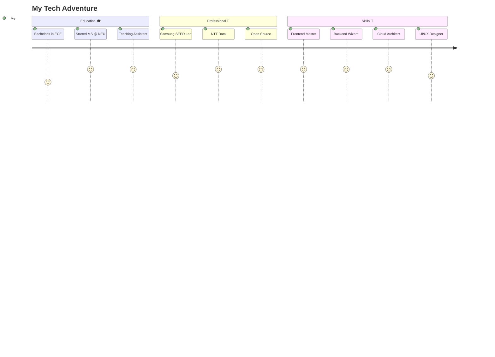

<div align="center">

<!-- Animated Header -->


<!-- Typing Animation -->
<a href="https://git.io/typing-svg"></a>

<!-- Social badges with animation -->
<p align="center">
  <a href="https://linkedin.com/in/nithish-kumar-km">
    
  </a>
  <a href="mailto:kuthandhallimanjun.n@northeastern.edu">
    
  </a>
  <a href="https://github.com/YOUR_USERNAME">
    
  </a>
  <a href="tel:+16177210107">
    
  </a>
</p>

<!-- Profile Views Counter -->
<p align="center">
  
</p>

</div>

---

## 🎯 **Quick Facts About Me**

```typescript
class NithishKumar {
    constructor() {
        this.name = "Nithish Kumar K M";
        this.location = "Boston, MA 🇺🇸";
        this.education = {
            current: "MS in Information Systems @ Northeastern",
            gpa: "3.8/4.0",
            graduation: "December 2026"
        };
        this.workExperience = [
            "👨‍🏫 Teaching Assistant @ Northeastern University",
            "💼 Senior Associate @ NTT Data",
            "🔬 Software Engineer @ Samsung SEED Lab"
        ];
        this.superpowers = [
            "☁️ Cloud Architecture (AWS Certified Brain)",
            "🎨 UI/UX Design (Making pixels dance)",
            "⚡ Full-Stack Development (Both sides of the force)",
            "🤖 AI/ML Data Annotation (10K+ images tagged!)"
        ];
        this.currentFocus = "Building scalable, user-centric cloud applications";
        this.funFact = "I can debug code faster than I can debug my life 😄";
    }
    
    sayHi() {
        console.log("Thanks for dropping by! Let's build something amazing together 🚀");
    }
}

const me = new NithishKumar();
me.sayHi();
```

<div align="center">

## 🌟 **My Development Journey**

</div>



---

<div align="center">

## 🔥 **Tech Arsenal**

<details open>
<summary><b>🎨 Frontend Magic</b></summary>
<br/>


**Creating beautiful, responsive, and interactive user experiences** ✨

</details>

<details open>
<summary><b>⚙️ Backend Power</b></summary>
<br/>


**Building robust, scalable APIs and microservices** 🚀

</details>

<details open>
<summary><b>☁️ Cloud & DevOps Mastery</b></summary>
<br/>


**AWS Services:** EC2 • S3 • Lambda • RDS • CloudFormation • CloudWatch • IAM • API Gateway • SNS • DynamoDB

**Automating everything and deploying with confidence** 🔧

</details>

<details open>
<summary><b>🗄️ Database Expertise</b></summary>
<br/>


**Data modeling, optimization, and management** 📊

</details>

<details open>
<summary><b>🎨 Design & Collaboration</b></summary>
<br/>


**From wireframes to production-ready designs** 🎯

</details>

</div>

---

<div align="center">

## 📊 **GitHub Analytics**


</div>

---

<div align="center">

## 🏆 **Projects That Make Me Proud**

</div>

<table align="center">
<tr>
<td width="50%" valign="top">

### 🍔 **EatWell - Food Ordering Platform**

   

```javascript
const impact = {
    userExperience: "+35%",
    performance: "+40%",
    features: [
        "🛒 Dynamic cart management",
        "💳 Secure Stripe payments",
        "📦 Real-time order tracking",
        "🎨 Reusable UI components"
    ]
};
```

**Full-stack MERN masterpiece with seamless payment integration!**

[🔗 View Project](https://github.com/YOUR_USERNAME/eatwell) | [🚀 Live Demo](#)

</td>
<td width="50%" valign="top">

### 🛍️ **Myntra E-Commerce Clone**

   

```csharp
var features = new[] {
    "🔐 Authentication & Authorization",
    "📝 Product Reviews & Ratings",
    "💼 Comprehensive Admin Panel",
    "🔄 Return Status Management",
    "⭐ Wishlist & Cart System"
};
```

**Enterprise-grade e-commerce with 10+ features → 30% engagement boost!**

[🔗 View Project](https://github.com/YOUR_USERNAME/myntra)

</td>
</tr>

<tr>
<td width="50%" valign="top">

### 💼 **Personal Portfolio Website**

  

```css
.portfolio {
    theme: "dark/light toggle";
    animations: "smooth & buttery";
    responsiveness: 100%;
    cross-browser: "compatible";
    wow-factor: "maximum";
}
```

**Interactive showcase of my journey and skills with stunning animations!**

[🔗 GitHub](https://github.com/YOUR_USERNAME/portfolio) | [🌐 Live Site](https://your-site.com)

</td>
<td width="50%" valign="top">

### 🚗 **Accident Detection System**

  

```c
// Real-time accident detection
if (accident_detected()) {
    get_gps_location();
    send_alert_via_gsm();
    notify_emergency_contacts();
}
```

**IoT solution for road safety with GPS/GSM integration!**

[🔗 View Project](https://github.com/YOUR_USERNAME/accident-detection)

</td>
</tr>
</table>

---

<div align="center">

## 💼 **Professional Impact**

<table>
<tr>
<td align="center" width="33%">

<br/>
<b>Teaching @ NEU</b>
<br/>
<code>50+ Students</code>
<br/>
<sub>Web Design & UX</sub>
</td>
<td align="center" width="33%">

<br/>
<b>Performance</b>
<br/>
<code>+15% @ NTT Data</code>
<br/>
<sub>System Optimization</sub>
</td>
<td align="center" width="33%">

<br/>
<b>AI Training</b>
<br/>
<code>10,000+ Images</code>
<br/>
<sub>Samsung SEED Lab</sub>
</td>
</tr>
<tr>
<td align="center" width="33%">

<br/>
<b>Development</b>
<br/>
<code>-20% Time</code>
<br/>
<sub>Scalable Solutions</sub>
</td>
<td align="center" width="33%">

<br/>
<b>ML Accuracy</b>
<br/>
<code>+18% Boost</code>
<br/>
<sub>Model Training</sub>
</td>
<td align="center" width="33%">

<br/>
<b>GPA</b>
<br/>
<code>3.8/4.0</code>
<br/>
<sub>MS @ Northeastern</sub>
</td>
</tr>
</table>

</div>

---

<div align="center">

## 🎯 **Current Focus**

</div>

```python
class CurrentlyWorkingOn:
    def __init__(self):
        self.learning = [
            "🏗️ Advanced System Design & Architecture",
            "🔐 AWS Security Best Practices",
            "⚡ Performance Optimization Techniques",
            "🎨 Advanced React Patterns & Hooks"
        ]
        
        self.building = [
            "☁️ Serverless applications with Lambda",
            "🔄 CI/CD pipelines with GitHub Actions",
            "📱 Responsive web applications",
            "🤖 AI-powered features integration"
        ]
        
        self.teaching = [
            "👨‍🏫 Web Development to 50+ students",
            "💡 Best practices in code quality",
            "🎨 UI/UX design principles",
            "🚀 Modern frontend frameworks"
        ]
    
    def goals_2025(self):
        return [
            "🎓 Complete MS degree with honors",
            "💼 Land dream SDE role",
            "📝 Contribute to major open-source projects",
            "🌟 Build impactful side projects"
        ]

me = CurrentlyWorkingOn()
print(f"Let's achieve: {me.goals_2025()}")
```

---

<div align="center">

## 🎨 **Contribution Snake**

<picture>
  <source media="(prefers-color-scheme: dark)" srcset="https://raw.githubusercontent.com/YOUR_USERNAME/YOUR_USERNAME/output/github-contribution-grid-snake-dark.svg">
  <source media="(prefers-color-scheme: light)" srcset="https://raw.githubusercontent.com/YOUR_USERNAME/YOUR_USERNAME/output/github-contribution-grid-snake.svg">
  
</picture>

</div>

---

<div align="center">

## 📚 **Latest Blog Posts**

<!-- BLOG-POST-LIST:START -->
- 🚀 [Building Scalable APIs with Node.js and Express](#)
- ☁️ [AWS Lambda: Serverless Architecture Guide](#)
- 🎨 [Modern UI/UX Design Principles](#)
- 💻 [Full-Stack Development Best Practices](#)
<!-- BLOG-POST-LIST:END -->

</div>

---

<div align="center">

## 💬 **Random Dev Quote**


</div>

---

<div align="center">

## 🤝 **Let's Connect & Collaborate!**

I'm always excited to discuss new projects, innovative ideas, or opportunities to create something amazing together!

<a href="https://linkedin.com/in/nithish-kumar-km">
  
</a>
<a href="mailto:kuthandhallimanjun.n@northeastern.edu">
  
</a>
<a href="https://github.com/YOUR_USERNAME">
  
</a>

### 📍 **Boston, MA** | 📞 **617-721-0107**

<br/>

### "First, solve the problem. Then, write the code." – John Johnson

<br/>

**Thanks for visiting! Happy Coding! 🚀**

</div>

<!-- Animated Footer -->


---

<div align="center">

### 🎵 **Currently Vibing To:**

[](https://spotify-github-profile.vercel.app/api/view?uid=YOUR_SPOTIFY_ID&redirect=true)

</div>
